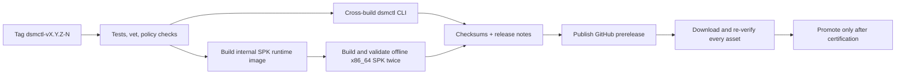

# Public release and distribution plan

This plan turns the repository README into the primary product and download
page for `dsmctl`, while keeping CLI and Synology package claims aligned with
their actual verification level.

## Desired user experience

A new visitor should be able to:

1. Understand the CLI and DSM package in under a minute.
2. Download a CLI archive directly from the README or run an inspectable
   installer that verifies its checksum.
3. Download the matching x86_64 Synology `.spk` from the same GitHub Release
   only when their DSM/model is listed as supported.
4. Verify that every CLI archive and `.spk` came from the same revision and
   carries the same dsmctl version.
5. Find compatibility, upgrade, recovery, and security limitations before
   installation rather than after it.

## Current state on 2026-07-23

| Area | Current state | Consequence |
| --- | --- | --- |
| GitHub repository | The current GitHub repository is public | README assets and public Releases can be used as the landing page. |
| GitHub Releases | Preview `dsmctl-v7.3.2-18` is published | Version-bound CLI, installer, and DSM package links are live; `releases/latest` still excludes this prerelease. |
| CI | Tests, builds, hardened container smoke tests, deterministic CLI archives, and the Gateway/SPK release build exist | The tag workflow can enforce the complete preview gate from one revision. |
| Release workflow | `gateway-release.yml` builds and validates CLI archives and the offline SPK, publishes a GitHub prerelease, then downloads and verifies it again | Tagged run `29984783750` published and re-verified all eight assets. No standalone container image or GHCR package is published. |
| Synology package | Reproducible x86_64 `.spk` builder and validation script exist | Package Center manual-install preview is feasible. Broad support claims are not. |
| Hardware certification | WI-017 still lacks AMD x86_64, DSM 7.2.x, reboot, and uninstall lifecycle coverage | Publish SPK builds as preview assets until the matrix is complete. |
| Artifact signing | WI-064 is explicitly deferred | Start with SHA-256 checksums and honest documentation; do not claim signed provenance. |
| Go module identity | `go.mod`, self-imports, and the public clone URL use `github.com/derekvery666/dsmctl` | The module is ready for versioned public consumption; advertise `go install ...@latest` only after the first release/tag smoke passes. |
| License | The root `LICENSE` is Apache-2.0 | Users may use and contribute under a clear open-source license. |

## Decisions recorded

1. **License:** Apache License 2.0.
2. **Canonical module path:** `github.com/derekvery666/dsmctl`.

## Preview decisions recorded

1. **Release channel:**
   - CLI: public preview after cross-platform smoke tests.
   - Synology SPK: preview only until WI-017's hardware/lifecycle matrix passes.
   - Local stdio MCP and standalone Gateway images are not release assets.
2. **Initial CLI support boundary:** Windows amd64 and Linux amd64, matching
   the current CI runners. macOS and arm64 remain follow-up targets.

## Decisions required before the first stable release

1. **Stable-release signing posture.** Checksums are sufficient for a preview,
   but stable-release wording must either explicitly accept checksum-only
   distribution or reopen WI-064 and choose a signing root of trust.
2. **Stable SPK support boundary.** Complete WI-017's named Intel/AMD,
   DSM-version, reboot, upgrade, and uninstall certification matrix.

## Release layout

Use one tag and one GitHub Release for artifacts produced from the same commit:

```text
dsmctl-v7.3.2-18
```

The public, versionless asset names below make README links and installers
stable across releases. The version remains in the release tag, binary
`--version` output, archive metadata, and optional versioned duplicate names.

| Asset | Contents | Initial status |
| --- | --- | --- |
| `dsmctl-windows-amd64.zip` | `dsmctl.exe`, Apache-2.0, and README excerpt | Preview |
| `dsmctl-linux-amd64.tar.gz` | `dsmctl`, Apache-2.0, and README excerpt | Preview |
| `dsmctl-linux-arm64.tar.gz` | Same, after an arm64 smoke test exists | Follow-up |
| `dsmctl-darwin-amd64.tar.gz` | CLI for Intel macOS | Follow-up after native smoke |
| `dsmctl-darwin-arm64.tar.gz` | CLI for Apple silicon | Follow-up after native smoke |
| `dsmctl-gateway-VERSION-x86_64.spk` | Offline Synology package including the exact Gateway image | WI-017 preview |
| `install.sh` / `install.ps1` | Inspectable checksum-verifying installers | Preview with explicit version |
| `SHA256SUMS` | SHA-256 for every downloadable byte | Required |
| `LICENSE` | Apache License 2.0 | Required |
| `SUPPORTED.md` | Exact DSM, model, Container Manager, and lifecycle evidence | Required for SPK |

Stable `releases/latest/download/...` links become available only after a
non-prerelease succeeds. Preview documentation uses the explicit tag, for
example:

```text
https://github.com/derekvery666/dsmctl/releases/download/dsmctl-v7.3.2-21/dsmctl-windows-amd64.zip
https://github.com/derekvery666/dsmctl/releases/download/dsmctl-v7.3.2-21/dsmctl-gateway-7.3.2-21-x86_64.spk
```

Do not make the SPK a `latest` README link while it is a preview; link to the
Release page and support matrix so the user must see the certification status.

## Build and publication pipeline

The existing `gateway-release.yml` is the single owner for CLI, SPK, and
GitHub Release publication so two tag workflows cannot race to publish or
overwrite assets. Manual dispatch performs a non-publishing build; a matching
`dsmctl-vX.Y.Z-N` tag creates or updates the prerelease.



Required gates:

1. Tag format and embedded version match exactly.
2. `go test ./...`, `go vet ./...`, and the no-lab-data policy pass.
3. Every advertised CLI target cross-builds with `CGO_ENABLED=0` and runs a
   `--version` smoke test on a native or emulated runner.
4. Archives contain only the intended executables and public documentation;
   no config, credentials, test state, NAS addresses, or logs are included.
5. The `.spk` fixed-input double builds are byte-identical.
6. `SHA256SUMS` is generated after final asset naming and verified by a second
   job that downloads the Release assets, not just the workspace copies.
7. The release starts as a draft/prerelease. A human checks release notes,
   support claims, screenshots, and the downloaded smoke results before
   publishing.

## Installer scripts

The installers ship beside the matching versionless CLI archive names. Preview
instructions require an explicit version; omitting it resolves only GitHub's
latest stable release.

### POSIX installer

`scripts/install.sh` should:

- support Linux amd64 initially; add macOS only with its native release smoke;
- default to `$HOME/.local/bin`, with an explicit `--prefix` override;
- resolve an explicit `--version` or the latest non-prerelease GitHub Release;
- download the archive and `SHA256SUMS` over HTTPS;
- verify the exact archive checksum before extraction;
- install `dsmctl` without `sudo` by default;
- print the installed paths, version, and any required PATH change;
- fail closed on an unknown OS/architecture, missing checksum, or mismatch.

Recommended documentation is inspect-then-run rather than an opaque pipe:

```console
curl -fsSLO https://raw.githubusercontent.com/derekvery666/dsmctl/main/scripts/install.sh
less install.sh
sh install.sh --version 7.3.2-18
```

### PowerShell installer

`scripts/install.ps1` should:

- begin with Windows amd64 and reject unknown architectures;
- install under `$env:LOCALAPPDATA\dsmctl\bin` by default;
- use `Invoke-WebRequest`, verify with `Get-FileHash -Algorithm SHA256`, and
  expand only after verification;
- offer an explicit `-AddToPath` switch instead of silently changing PATH;
- support a `-Version` switch;
- remove partial temporary downloads on failure.

Recommended documentation:

```powershell
Invoke-WebRequest https://raw.githubusercontent.com/derekvery666/dsmctl/main/scripts/install.ps1 -OutFile install.ps1
Get-Content .\install.ps1
.\install.ps1 -Version 7.3.2-18 -AddToPath
```

## Synology package rollout

The first public `.spk` should be a GitHub Release preview for manual Package
Center upload, not a claim of broad Synology Package Center availability.

Release notes must state:

- x86_64 Synology only; ARM models are not compatible with this package;
- the exact supported DSM, model, and Container Manager versions from
  `deploy/synology/SUPPORTED.md`;
- the package includes an offline Gateway image and does not pull a registry
  image during install;
- DSM Web Login is the default administration boundary on SPK installs;
- backend publication is loopback-only and DSM reverse proxy/TLS provides the
  browser entry point;
- backup, upgrade, retained-data uninstall, and delete-data uninstall behavior;
- known unverified lifecycle paths and the preview support policy.

After WI-017 completes, promote the SPK to stable manual install. A Synology
Package Center repository or official catalog submission should be a later
milestone with its own signing, update-channel, hosting, and rollback policy.

## GitHub landing-page checklist

Before broad promotion:

- keep the Apache-2.0 `LICENSE`; add `SECURITY.md`, contribution guidance, and
  a support policy;
- set the repository description and topics (`synology`, `dsm`, `mcp`,
  `nas`, `golang`, `cli`) and add a social-preview image;
- keep the README hero, four current Admin screenshots, install status, and
  support limitations above the long command reference;
- add issue forms for bug reports, DSM compatibility reports, and package
  installation reports with DSM/model/build fields;
- prepare a release-note template with highlights, compatibility evidence,
  breaking changes, upgrade steps, checksums, and known limitations;
- never include lab IPs, serials, MAC addresses, account names, credentials, or
  live NAS screenshots in public artifacts.

## Rollout sequence

### Phase 0 — landing page and truthful status

- Publish the revised README and refreshed fictional-data screenshots.
- Keep source-build instructions for contributors and local stdio MCP users.
- License and canonical Go module path were resolved on 2026-07-23.

### Phase 1 — CLI preview

- The Windows/Linux amd64 archive build and release publication job are ready.
- Checksum-verifying POSIX and PowerShell installers are ready.
- Preview `dsmctl-v7.3.2-18` is published; the workflow downloaded and
  re-verified every asset after publication.
- README direct CLI downloads and installer commands are live.

### Phase 2 — Synology SPK preview, then stable

- Attach the validated x86_64 `.spk`, checksums, and support matrix to the
  same release.
- Keep it marked preview until WI-017 completes AMD/Intel, DSM-version, reboot,
  upgrade, retained uninstall, and delete-data uninstall verification.
- Promote to stable manual install only when every claimed path has evidence.

### Phase 3 — trust and broader distribution

- Revisit WI-064 before claiming cryptographically signed releases.
- Consider Homebrew, Scoop/WinGet, a Package Center repository, and a dedicated
  documentation site only after GitHub Releases and upgrades are reliable.

## Definition of done

The public distribution goal is complete when a clean machine can start from
the README, download the correct CLI without Go, verify it, run
`dsmctl --version`, connect a NAS through the documented human authentication
flow, and remove the binary cleanly; and when an eligible Synology user can
identify support status, download the matching `.spk`, verify its checksum,
install it offline, open Gateway Admin through DSM TLS, upgrade without state
loss, and follow a tested uninstall/recovery path.
