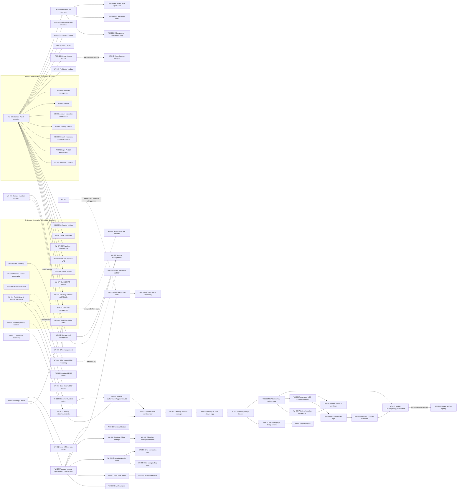

# Roadmap

The management-first sequence is storage, SAN, and focused Control Panel
modules. Reliability and explanation work can proceed in parallel because it
does not depend on destructive storage APIs.

## Dependency graph

## Work queue

| ID | Priority | Status | Parallel group | Depends on | Summary |
| --- | --- | --- | --- | --- | --- |
| [WI-001](work-items/WI-001-storage-mutation-contract.md) | P0 | `done` | A | — | Define storage manifests and hash-bound plan/apply without enabling writes. |
| [WI-002](work-items/WI-002-storage-pool-management.md) | P0 | `done` | A | WI-001 | Guarded storage-pool create/expand/delete variants. |
| [WI-003](work-items/WI-003-volume-management.md) | P0 | `done` | A | WI-001, WI-002 | Guarded volume create/update/delete variants. |
| [WI-004](work-items/WI-004-san-inventory.md) | P0 | `done` | B | — | Read-only iSCSI target, LUN, and mapping inventory. |
| [WI-005](work-items/WI-005-san-management.md) | P1 | `done` | B | WI-004, WI-001 | Guarded SAN target/LUN/mapping management. |
| [WI-006](work-items/WI-006-control-panel-modules.md) | P1 | `done` | C | — | Establish focused Control Panel module boundaries and ship the first read slice. |
| [WI-007](work-items/WI-007-effective-access-explanation.md) | P1 | `done` | D | — | Explain effective share and application access across memberships and inheritance. |
| WI-008 | P2 | `proposed` | E | product decisions | Encrypted-share keys, WORM, and custom Windows ACL safeguards. **Decision (2026-07-20): secret/key material is vault-managed (credential store) and retrievable only via a human-gated reveal — never over MCP.** WORM + custom-ACL scope still open. |
| [WI-009](work-items/WI-009-credential-lifecycle.md) | P2 | `done` | D | — | Credential status/removal and trusted-device rotation. |
| WI-010 | P1 | `proposed` | E | ongoing | **Decomposed** into WI-060 (structured DSM errors), WI-061 (observability logging), WI-062 (CI matrix + live-test policy), WI-063 (CLI/MCP schema stability), and WI-064 (release-artifact signing). Umbrella tracker only; implement the children. |
| [WI-011](work-items/WI-011-control-panel-time-mutation.md) | P2 | `done` | C | WI-006 | Guarded time zone, display format, and NTP changes. |
| [WI-012](work-items/WI-012-file-services-smb-nfs.md) | P1 | `done` | C | WI-006 | Guarded global SMB and NFS state and settings. |
| [WI-013](work-items/WI-013-ssd-cache.md) | P2 | `done` | A | WI-001, WI-002, WI-003 | SSD cache inventory and guarded create/remove (expand/convert modeled, backend-gated). |
| [WI-014](work-items/WI-014-portable-gateway-daemon.md) | P0 | `done` | F | - | Establish a platform-neutral, read-only Streamable HTTP gateway and hardened amd64 container. |
| [WI-015](work-items/WI-015-gateway-state-vault-admin.md) | P0 | `done` | F | WI-014 | Add transactional profiles, encrypted vault storage, administration, and runtime invalidation. |
| [WI-016](work-items/WI-016-remote-authorization-approval-audit.md) | P0 | `done` | F | WI-014, WI-015 | Enforce scoped remote authorization, out-of-band high-risk approval, and redacted audit. |
| [WI-017](work-items/WI-017-amd64-linux-synology-distribution.md) | P1 | `in_progress` | G | WI-014, WI-015, WI-016, WI-032, WI-033, WI-035, WI-037, WI-038 | Ship the same amd64 image for generic Linux and an offline Synology x86_64 Container Manager SPK. |
| [WI-018](work-items/WI-018-system-log.md) | P2 | `done` | D | — | Read-only DSM system log (Log Center) inventory with keyword/type/level/paging filters. |
| [WI-019](work-items/WI-019-package-center.md) | P1 | `done` | C | — | Package Center inventory, read-only settings, and guarded start/stop/uninstall (install/update/settings-set deferred). |
| [WI-020](work-items/WI-020-package-settings-write.md) | P2 | `done` | C | WI-019 | Guarded Package Center automatic-update settings write (trust/beta/volume writes deferred). |
| [WI-021](work-items/WI-021-resource-monitor.md) | P2 | `done` | D | — | Resource Monitor current utilization + recorded history reads and a guarded history-recording toggle. |
| [WI-022](work-items/WI-022-package-scoped-operations.md) | P1 | `done` | C | WI-019 | Package-version-aware operation selection framework plus the read-only Drive Admin module. |
| [WI-023](work-items/WI-023-lan-device-discovery.md) | P2 | `done` | H | — | Session-less findhost UDP broadcast discovery of Synology devices on the LAN. |
| [WI-024](work-items/WI-024-nfs-share-export-rules.md) | P1 | `done` | C | WI-012 | Guarded per-shared-folder NFS export rules (client, privilege, squash, security, async). |
| [WI-025](work-items/WI-025-nfs-advanced-write.md) | P1 | `done` | C | WI-012 | Guarded NFSv4 domain write via full advanced-snapshot preservation (packet-size/port writes deferred). |
| [WI-026](work-items/WI-026-smb-advanced-service-discovery.md) | P2 | `done` | C | WI-012 | Service discovery (Time Machine + WS-Discovery) and SMB advanced toggles (oplock, leases, durable handles, local master browser). |
| [WI-027](work-items/WI-027-ftp-sftp.md) | P2 | `done` | C | WI-006 | Guarded FTP/FTPS and SFTP service switches and SFTP port (advanced FTP "Others" fields deferred). |
| [WI-028](work-items/WI-028-rsync-tftp.md) | P3 | `done` | C | WI-006 | Guarded rsync service (switch + account) and TFTP service (switch, root, permission, logging, timeout); SSH-port and IP-range writes deferred; AFP/WebDAV out of scope. |
| [WI-029](work-items/WI-029-package-install-update.md) | P2 | `done` | C | WI-019 | Online package catalog read, guarded online install, and guarded version-bound update (downgrade refused, stable-over-beta), CLI + MCP, live-verified (installed Synology Photos; updated PHP 8.2). |
| [WI-030](work-items/WI-030-photos-admin.md) | P2 | `done` | C | WI-019, WI-022 | Synology Photos administration module: read + guarded partial write of `SYNO.Foto.Setting.Admin` (package-gated), CLI + MCP, live-verified. |
| [WI-031](work-items/WI-031-drive-server-config.md) | P2 | `done` | C | WI-022 | Guarded Synology Drive server database config (vmtouch pair) via `SYNO.SynologyDrive.Config`; first Drive write, CLI + MCP, live-verified. |
| [WI-032](work-items/WI-032-gateway-local-administrator.md) | P0 | `done` | G | WI-015, WI-016 | Replace bootstrap/platform administration with a portable one-hour local-account setup and browser sessions. |
| [WI-033](work-items/WI-033-gateway-admin-ui-redesign.md) | P1 | `done` | G | WI-032 | Redesign the local Gateway administration UI as a polished, responsive NAS control application. |
| [WI-034](work-items/WI-034-surveillance-station.md) | P2 | `done` | C | WI-019, WI-022, WI-029 | Read-only Surveillance Station module (system info + camera list), package-gated; installed via the dependency-aware CLI installer. |
| [WI-035](work-items/WI-035-mcp-server-product-copy.md) | P1 | `done` | G | WI-033 | Add concise MCP Server product copy in English, Traditional Chinese, Simplified Chinese, Japanese, and German. |
| [WI-036](work-items/WI-036-surveillance-home-mode.md) | P2 | `done` | C | WI-034 | Guarded Surveillance Station Home Mode switch (on/off) via `SYNO.SurveillanceStation.HomeMode`; first Surveillance write, CLI + MCP, live-verified. |
| [WI-037](work-items/WI-037-gateway-design-tokens.md) | P1 | `done` | G | WI-035 | Unify authentication and administration colors through shared brand-blue and slate design tokens. |
| [WI-038](work-items/WI-038-mcp-server-flow-refinements.md) | P1 | `done` | G | WI-037 | Streamline high-risk approval, MCP-token lifecycle, NAS enrollment, and audit flows; require explicit remote NAS targets; rename `nas.admin` to `lan.discover`. |
| [WI-039](work-items/WI-039-weblogin-page-design-tokens.md) | P2 | `done` | G | WI-037 | Restyle the `auth login` loopback helper page with the shared design tokens, four localized sign-in states, and browser-language detection. |
| [WI-040](work-items/WI-040-dsmctl-favicon.md) | P2 | `done` | G | WI-037, WI-039 | Design one small-size dsmctl favicon and apply it consistently to the Admin UI and web-login helper. |
| [WI-041](work-items/WI-041-external-access.md) | P2 | `done` | C | WI-006 | External Access module: read-only Synology Account/QuickConnect/DDNS/port-forward + guarded writes for QuickConnect relay, config (enable/alias/region), per-service exposure, and DDNS record CRUD, CLI + MCP (gateway strips writes). Permission + relay live-verified; config/DDNS wire-shape-from-source, not live-applied (real alias/no provider), fail closed. QuickConnect-as-transport carved out to WI-042. |
| [WI-042](work-items/WI-042-quickconnect-transport.md) | P3 | `proposed` | H | — | Reach a NAS by its QuickConnect ID: coordinator resolution (get_site_list/get_server_info) to a Direct endpoint, then the existing login/client path; relay/hole-punch is a stretch. Connection-layer, not a Control Panel module. |
| [WI-043](work-items/WI-043-download-station.md) | P2 | `done` | C | WI-019, WI-022 | Download Station module, package-gated on DownloadStation: reads, guarded task create/pause/resume/delete/edit, group-dispatched settings writes, and credential-ref NZB/extraction password changes, CLI + MCP, live-verified on 4.1.2; eMule group and search/RSS management out of scope. |
| [WI-044](work-items/WI-044-dsm-compatibility-versioning.md) | P1 | `done` | E | - | Version all front ends and release artifacts from the certified DSM compatibility train plus a dsmctl build revision. |
| [WI-045](work-items/WI-045-power-user-mcp-connection-design.md) | P1 | `done` | G | WI-038 | Define the private power-user connection, default-authority, client identity, and interoperability gap model. |
| [WI-046](work-items/WI-046-gateway-admin-ui-spacing-feedback.md) | P2 | `done` | G | WI-038 | Correct Admin UI vertical rhythm, password grouping, and dismissible feedback behavior. |
| [WI-047](work-items/WI-047-admin-ui-workflow-redesign.md) | P1 | `done` | G | WI-045, WI-046 | Redesign authenticated pages around resource lists, state-aware actions, and guided workflows. |
| [WI-048](work-items/WI-048-mcp-oauth-url-login.md) | P0 | `done` | G | WI-045 | Add standards-based MCP OAuth URL login while retaining manual client tokens. |
| [WI-050](work-items/WI-050-drive-team-folder-write.md) | P1 | `done` | C | WI-022, WI-031 | Guarded Drive team-folder enable/disable and versioning via `SYNO.SynologyDrive.Share` set, replacing the WI-022 fail-closed stub; CLI + MCP. |
| [WI-059](work-items/WI-059-drive-log-export.md) | P3 | `done` | C | WI-022 | Drive log export to CSV (Log.export file response via a raw file POST transport), CLI + MCP (excluded from the read-only gateway); live-verified; Log.delete stays deferred. |
| [WI-058](work-items/WI-058-drive-node-restore.md) | P2 | `done` | C | WI-057 | Guarded Drive node restore of removed nodes (async Restore start/status/finish task), completing the rescue story; CLI + MCP, live-verified end-to-end (upload → delete → restore) and reverted. |
| [WI-057](work-items/WI-057-drive-node-views.md) | P2 | `done` | C | WI-022, WI-050 | Drive rescue-view reads: browse team folders/My Drive including removed entries, and per-node version history; CLI + MCP, live-verified. Node.Restore write deferred as its own item. |
| [WI-056](work-items/WI-056-drive-home-versioning.md) | P3 | `done` | C | WI-050 | My Drive home versioning via the team-folder write (set_versioning only), always high risk with a fan-out warning; live-verified 8→10→8. |
| [WI-055](work-items/WI-055-drive-user-privilege-view.md) | P2 | `done` | C | WI-022, WI-053 | Drive user-privilege view read; live-verified that Drive access control is the account module's application privilege (Privilege.set deliberately not exposed). |
| [WI-054](work-items/WI-054-drive-connection-kick.md) | P2 | `done` | C | WI-022, WI-053 | Guarded Drive client-session disconnect (Connection.delete v2) plus source-true connection fields incl. session id; CLI + MCP. |
| [WI-053](work-items/WI-053-drive-observability-reads.md) | P2 | `done` | C | WI-022 | Drive Admin observability reads: connection summary, cached DB usage, top accessed files, and package activation state; CLI + MCP, live-verified. |
| [WI-051](work-items/WI-051-office-admin.md) | P2 | `done` | C | WI-019, WI-022 | Synology Office settings module: info/system-setting/preferences/fonts reads + guarded system and preference writes (package-gated on `Spreadsheet`), CLI + MCP, live-verified; font mutations and per-object settings deferred. |
| [WI-052](work-items/WI-052-office-font-management.md) | P2 | `done` | C | WI-051 | Guarded Office custom-font name-registry management (add/enable/disable/delete) as a third Office change scope; custom/enabled font read fields; TTF upload deferred. |
| [WI-049](work-items/WI-049-file-station.md) | P1 | `done` | C | WI-006 | Full read/write FileStation module (core SYNO.FileStation.*), shipped + live-verified end-to-end on DSM 7.3: reads (list/stat/search/dir-size/md5/virtual-folders/permission-check), streaming download+upload binary transport, and the mutation surface (create/rename/copy/move/delete/compress/extract/upload + sharing links) via hash-bound plan/apply, plus favorites and background-task list — across CLI (`file …`) and MCP (114 tools; read-only gateway strips writes + content transfer). Follow-ons shipped + live-verified: Sharing edit/clear_invalid, image Thumb.get (streaming binary read, gateway-stripped), and BackgroundTask.clear_finished; transfer errors now redact _sid/SynoToken. |
| [WI-060](work-items/WI-060-structured-dsm-errors.md) | P1 | `in_progress` | E | — | Structured DSM error taxonomy: closed category set + classifier (preserved through wrapping) and documented CLI exit codes shipped with tests + `docs/errors.md`. Deferred follow-on: per-tool MCP `category` field (needs central error middleware) and HTTP-transient typing + retry. |
| [WI-061](work-items/WI-061-core-observability-logging-redaction.md) | P1 | `done` | E | — | Core opt-in structured logging (`--log-level`/`DSMCTL_LOG_LEVEL`, stderr-only) with a redaction guarantee and per-DSM-call record (correlation id/api/method/version/status/duration), for CLI + stdio MCP; live-verified. stdio-MCP per-call correlation id deferred with WI-060's MCP middleware. |
| [WI-062](work-items/WI-062-ci-matrix-live-test-policy.md) | P1 | `done` | E | — | CI test matrix (ubuntu + windows unit/request-capture gate) with a guard that fails if any live-test env var is set so destructive mutations can never run in CI; Docker/gateway steps split into a Linux-only job; `docs/testing.md` + an in-repo DSM compatibility evidence record in `docs/compatibility.md`. |
| [WI-063](work-items/WI-063-cli-mcp-schema-stability-policy.md) | P1 | `proposed` | E | WI-044 | CLI/MCP schema-stability policy (M4): covered-surface set, stable/experimental tiers, deprecation window, changelog discipline, and golden drift guards. **D1 resolved (2026-07-20): no fixed removal window — the operation is the stable abstraction, carrying per-variant DSM-version ranges (WI-044 model), supported unbounded forward/backward; a DSM version with no matching variant is reported out-of-range (fail-closed), never silently broken.** D2 signal + D3 coverage boundary still to pick. |
| [WI-064](work-items/WI-064-release-artifact-signing-verification.md) | P2 | `deferred` | E | WI-017 | Sign and verify WI-017's release artifacts: signed SHA256SUMS, DSSE provenance bound to digests, attested SBOM, and an offline-capable `verify-release.sh`. **Decision (2026-07-20): not signing for now — deferred; revisit when release signing is prioritized.** |
| [WI-065](work-items/WI-065-certificate.md) | P1 | `done` | C | WI-006 | Certificate management: read slice (CRT.list) + guarded Slice B writes (import/set-default/bind/delete/export) via hash-bound plan/apply, private key via credential_ref, current-session re-pin protection, export gateway-stripped + path-confined; CLI + MCP; adversarially reviewed twice. Live-verified on DSM 7.3: import posts the parent `SYNO.Core.Certificate` api (not `.CRT`), `as_default=false` preserves the existing default, and delete uses `ids` (not `id` → 5503). `set`-default / service-`bind` param names stay source-derived; Let's Encrypt issuance a non-goal. |
| [WI-066](work-items/WI-066-firewall.md) | P1 | `in_progress` | C | WI-006 | Firewall: **read slice shipped + live-verified on DSM 7.3** (single active `Firewall.Profile`; rules live inside `Profile.get` not `Rules.*`; GeoIP/Country APIs absent on 7.3; per-rule fields WIRE-UNVERIFIED — lab has 0 rules). Guarded rule create/reorder/enable/delete + default policy with a never-drop-the-current-session lockout guard **deferred (very high risk)**. |
| [WI-067](work-items/WI-067-accountprotection.md) | P2 | `in_progress` | C | WI-006 | Account protection: **read slice shipped + live-verified on DSM 7.3** (account-protection = `SYNO.Core.SmartBlock`; `AutoBlock.Rules` list needs `type=deny/allow`; DoS read param undiscoverable → capability-only; OTP secrets never decoded). Guarded writes (auto-block/lists/DoS/enforced-2FA, with self-lockout guard) **deferred**. |
| [WI-068](work-items/WI-068-security-advisor.md) | P2 | `in_progress` | C | WI-006 | Security Advisor: **read slice shipped + live-verified on DSM 7.3** (`SecurityScan.Status.system_get` + `Conf.get`; baseline field = `defaultGroup`; no item-level findings API — per-category severity only; `Result`/`Info`/`Category` APIs don't exist). Guarded run-scan + schedule/baseline writes **deferred**. |
| [WI-069](work-items/WI-069-network.md) | P2 | `proposed` | C | WI-006 | Network interfaces/bonding/routing: read general+per-NIC+bond+static routes; guarded writes with a never-sever-the-management-NIC guard. Extreme risk. |
| [WI-070](work-items/WI-070-loginportal.md) | P2 | `in_progress` | C | WI-006 | Login Portal: **read slice shipped + live-verified on DSM 7.3** (`Web.DSM` v1 selected over v2 which drops https/hsts; HTTP/2 = `enable_spdy`; AppPortal + `AppPortal.ReverseProxy` lists; reverse-proxy per-rule fields spec-derived pending a populated rule). Guarded writes (port/HSTS/redirect, portal, reverse-proxy CRUD) **deferred (high risk — changes how DSM is reached)**. |
| [WI-071](work-items/WI-071-terminalsnmp.md) | P2 | `in_progress` | C | WI-006 | Terminal + SNMP: **read slice shipped + live-verified on DSM 7.3** (`Core.Terminal` + `Core.SNMP` v1; SNMP merges v1/v2c into `enable_snmp_v1v2`, community = `rocommunity`, v3 user = `rouser`; secrets never decoded; trap fields WIRE-UNVERIFIED — SNMP off on lab). Guarded writes (SSH/Telnet enable + port, SNMP secrets via credential_ref + trap) **deferred**. |
| [WI-072](work-items/WI-072-notification.md) | P2 | `in_progress` | C | WI-006 | Notification settings: read+guarded email/SMS/push/webhook targets (secrets via credential_ref) + per-event rules + desktop toggles and the notification history feed (Slice A read shipped first); send-a-test-message action. |
| [WI-073](work-items/WI-073-taskscheduler.md) | P2 | `proposed` | C | WI-006 | Task Scheduler: read/list tasks; guarded create/edit/delete/run of scheduled+triggered scripts and service tasks. High risk (scheduled root code execution). |
| [WI-074](work-items/WI-074-dsmupdate.md) | P2 | `proposed` | C | WI-006 | DSM update + config backup: read update status + auto-update policy (guarded); DSM install (reboot) and config restore deferred/guarded like the package-upgrade precedent. |
| [WI-075](work-items/WI-075-hardware.md) | P3 | `proposed` | C | WI-006 | Hardware/Power/UPS: read+guarded beep/fan/LED, power schedule, power-recovery, and UPS mode/thresholds. Power schedule/recovery/UPS high risk. |
| [WI-076](work-items/WI-076-externaldevice.md) | P3 | `proposed` | C | WI-006 | External devices: read USB/eSATA volumes + printers; guarded eject and printer settings. |
| [WI-077](work-items/WI-077-disk-smart-health.md) | P2 | `proposed` | C | WI-006 | Disk SMART + health: read disk health + SMART attributes; guarded SMART-test run + schedule. Complements the storage inventory (which lacks per-disk SMART). |
| [WI-078](work-items/WI-078-directory.md) | P2 | `proposed` | C | WI-006 | Directory services: read domain/LDAP join status + synced users/groups; guarded AD/LDAP join/leave (bind password via credential_ref). High risk (changes NAS auth). |
| [WI-079](work-items/WI-079-kmip.md) | P3 | `proposed` | C | WI-006 | KMIP key management: read client/server config+status; guarded config write (material via credential_ref). High risk (can make encrypted shares unmountable). Coordinates with WI-008. |
| [WI-080](work-items/WI-080-universalsearch.md) | P3 | `proposed` | C | WI-019, WI-022 | Universal Search index management (package-gated): read indexed folders+status; guarded add/remove/reindex. |
| [WI-081](work-items/WI-081-automatic-tls-trust-enrollment.md) | P2 | `in_progress` | G | WI-032, WI-048 | Automatic TLS trust enrollment: shared `internal/tlstrust` package + CLI `auth` and Gateway-admin trust-on-first-use enrollment, replacing manual fingerprint paste without weakening pin-on-first-use (a changed pin is never silently re-trusted). Committed on `claude/tls-trust-enrollment-wi081`; resolves the mis-filed-as-WI-051 number collision (that file is removed). |
| [WI-082](work-items/WI-082-local-package-install.md) | P2 | `done` | C | WI-019, WI-029 | Local (offline) `.spk` install via `Installation.upload` → `install` (task_id/path), reusing WI-029 status machinery; CLI + MCP; read-only gateway strips the plan/apply tools. Live-verified on the DSM 7.3 lab (Text Editor `.spk` install → confirm → uninstall, wire shape needed no correction). |
| [WI-083](work-items/WI-083-nas-provision.md) | P2 | `in_progress` | G | WI-081 | Provision a fresh Synology from its DSM setup window: sessionless first-admin creation (`SYNO.Entry.Request` compound: `User.create` + `Group.Member add administrators`), password generated locally and stored in the OS keyring, retrievable only by a human via the TTY-gated `dsmctl auth reveal-password` (isatty + typed confirmation; never a model, never MCP), plus wizard completion (`hide_welcome`, update policy, analytics-off) and flexible NAS identity/endpoint config. Live-verified on a DS918+ (DSM 7.3.1); merged to main. Runtime failover, `auth open`, and the MCP no-password guard test are deferred. Companion skill `.claude/skills/nas-provision`. |
| [WI-088](work-items/WI-088-gateway-nas-credential-copy.md) | P2 | `done` | G | WI-015, WI-032, WI-047 | Gateway Admin NAS list credential copy: audited `POST …/credentials/reveal` returns the vault-stored DSM account+password to the signed-in administrator browser session only (404 without a stored password; env fallback and web-login session material never revealed; nothing over `/mcp`, per WI-008), plus localized Copy account / Copy password row actions. WI-084–087 are consumed by parallel provision/Hyper Backup sessions. |

Parallel groups indicate likely file overlap. Items in different groups may run
at the same time after checking their `touches` lists. Only one agent should
work on an individual item.

## In-flight reconciliation (2026-07-20)

A ground-truth pass (spec claims vs. actual code + git) found two features being
actively worked on as **uncommitted WIP** with no roadmap presence; both are now
registered above:

- **[WI-081](work-items/WI-081-automatic-tls-trust-enrollment.md)** (Automatic
  TLS trust enrollment) — dirty in the local `main` worktree, mis-filed as
  `WI-051` (already taken by the shipped Office module). Renumber the draft to
  WI-081 and correct its `status` before committing.
- **[WI-082](work-items/WI-082-local-package-install.md)** (Local `.spk`
  install) — dirty on `claude/spk-install-cli-ed5ef5`, no prior number.

The three long-standing `in_progress` items reflect *partial* completion, not
stalled work: **WI-017** is code/asset-complete pending real Intel/AMD x86_64
Synology hardware certification; **WI-060** shipped its taxonomy + CLI-exit-code
core with the MCP `category` field and transient read-only retry deferred;
**WI-065** shipped Slice A (read) with all of Slice B (guarded writes) still
absent from the codebase.

## Milestone definition

### M1 — Storage composition

An LLM or CLI user can describe supported storage-pool and volume topology,
receive a deterministic plan, inspect destructive consequences, and apply only
against a deliberately provisioned test target.

### M2 — SAN composition

The same application layer can inventory and manage targets, LUNs, and mappings
without exposing raw DSM API calls.

### M3 — Control Panel composition

Focused modules expose typed state and changes for selected system settings.
The project does not become an untyped generic configuration proxy.

### M4 — Operational standard

Compatibility evidence, error semantics, packaging, and documentation are
strong enough for third-party integrations to depend on stable CLI/MCP schemas.

### M5 - Portable gateway distribution

A single-owner operator can run one hardened `linux/amd64` gateway on ordinary
Linux or install the identical image through a Synology x86_64 SPK, administer
multiple independently authenticated NAS profiles, expose scoped remote MCP
access, and require out-of-band approval for high-risk apply. The full scope and
platform decisions are in
[`gateway-deployment.md`](gateway-deployment.md).
