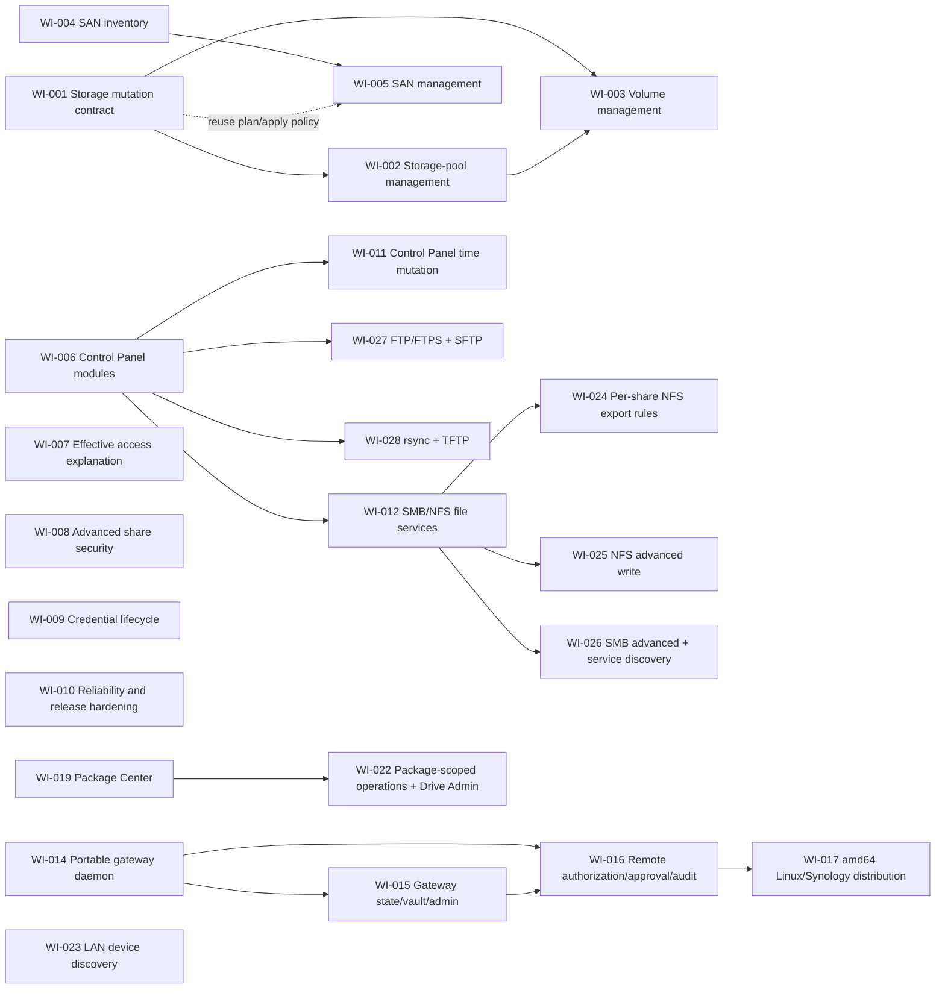

# Roadmap

The management-first sequence is storage, SAN, and focused Control Panel
modules. Reliability and explanation work can proceed in parallel because it
does not depend on destructive storage APIs.

## Dependency graph

## Work queue

| ID | Priority | Status | Parallel group | Depends on | Summary |
| --- | --- | --- | --- | --- | --- |
| [WI-001](work-items/WI-001-storage-mutation-contract.md) | P0 | `done` | A | — | Define storage manifests and hash-bound plan/apply without enabling writes. |
| [WI-002](work-items/WI-002-storage-pool-management.md) | P0 | `done` | A | WI-001 | Guarded storage-pool create/expand/delete variants. |
| [WI-003](work-items/WI-003-volume-management.md) | P0 | `done` | A | WI-001, WI-002 | Guarded volume create/update/delete variants. |
| [WI-004](work-items/WI-004-san-inventory.md) | P0 | `done` | B | — | Read-only iSCSI target, LUN, and mapping inventory. |
| [WI-005](work-items/WI-005-san-management.md) | P1 | `done` | B | WI-004, WI-001 | Guarded SAN target/LUN/mapping management. |
| [WI-006](work-items/WI-006-control-panel-modules.md) | P1 | `done` | C | — | Establish focused Control Panel module boundaries and ship the first read slice. |
| [WI-007](work-items/WI-007-effective-access-explanation.md) | P1 | `done` | D | — | Explain effective share and application access across memberships and inheritance. |
| WI-008 | P2 | `proposed` | E | product decisions | Encrypted-share keys, WORM, and custom Windows ACL safeguards. |
| [WI-009](work-items/WI-009-credential-lifecycle.md) | P2 | `done` | D | — | Credential status/removal and trusted-device rotation. |
| WI-010 | P1 | `proposed` | E | ongoing | Structured DSM errors, observability, CI matrix, packaging, and release policy. |
| [WI-011](work-items/WI-011-control-panel-time-mutation.md) | P2 | `done` | C | WI-006 | Guarded time zone, display format, and NTP changes. |
| [WI-012](work-items/WI-012-file-services-smb-nfs.md) | P1 | `done` | C | WI-006 | Guarded global SMB and NFS state and settings. |
| [WI-013](work-items/WI-013-ssd-cache.md) | P2 | `done` | A | WI-001, WI-002, WI-003 | SSD cache inventory and guarded create/remove (expand/convert modeled, backend-gated). |
| [WI-014](work-items/WI-014-portable-gateway-daemon.md) | P0 | `done` | F | - | Establish a platform-neutral, read-only Streamable HTTP gateway and hardened amd64 container. |
| [WI-015](work-items/WI-015-gateway-state-vault-admin.md) | P0 | `ready` | F | WI-014 | Add transactional profiles, encrypted vault storage, administration, and runtime invalidation. |
| [WI-016](work-items/WI-016-remote-authorization-approval-audit.md) | P0 | `blocked` | F | WI-014, WI-015 | Enforce scoped remote authorization, out-of-band high-risk approval, and redacted audit. |
| [WI-017](work-items/WI-017-amd64-linux-synology-distribution.md) | P1 | `blocked` | G | WI-014, WI-015, WI-016 | Ship the same amd64 image for generic Linux and an offline Synology x86_64 Container Manager SPK. |
| [WI-018](work-items/WI-018-system-log.md) | P2 | `done` | D | — | Read-only DSM system log (Log Center) inventory with keyword/type/level/paging filters. |
| [WI-019](work-items/WI-019-package-center.md) | P1 | `done` | C | — | Package Center inventory, read-only settings, and guarded start/stop/uninstall (install/update/settings-set deferred). |
| [WI-020](work-items/WI-020-package-settings-write.md) | P2 | `done` | C | WI-019 | Guarded Package Center automatic-update settings write (trust/beta/volume writes deferred). |
| [WI-021](work-items/WI-021-resource-monitor.md) | P2 | `done` | D | — | Resource Monitor current utilization + recorded history reads and a guarded history-recording toggle. |
| [WI-022](work-items/WI-022-package-scoped-operations.md) | P1 | `done` | C | WI-019 | Package-version-aware operation selection framework plus the read-only Drive Admin module. |
| [WI-023](work-items/WI-023-lan-device-discovery.md) | P2 | `done` | H | — | Session-less findhost UDP broadcast discovery of Synology devices on the LAN. |
| [WI-024](work-items/WI-024-nfs-share-export-rules.md) | P1 | `done` | C | WI-012 | Guarded per-shared-folder NFS export rules (client, privilege, squash, security, async). |
| [WI-025](work-items/WI-025-nfs-advanced-write.md) | P1 | `done` | C | WI-012 | Guarded NFSv4 domain write via full advanced-snapshot preservation (packet-size/port writes deferred). |
| [WI-026](work-items/WI-026-smb-advanced-service-discovery.md) | P2 | `done` | C | WI-012 | Service discovery (Time Machine + WS-Discovery) and SMB advanced toggles (oplock, leases, durable handles, local master browser). |
| [WI-027](work-items/WI-027-ftp-sftp.md) | P2 | `done` | C | WI-006 | Guarded FTP/FTPS and SFTP service switches and SFTP port (advanced FTP "Others" fields deferred). |
| [WI-028](work-items/WI-028-rsync-tftp.md) | P3 | `done` | C | WI-006 | Guarded rsync service (switch + account) and TFTP service (switch, root, permission, logging, timeout); SSH-port and IP-range writes deferred; AFP/WebDAV out of scope. |

Parallel groups indicate likely file overlap. Items in different groups may run
at the same time after checking their `touches` lists. Only one agent should
work on an individual item.

## Milestone definition

### M1 — Storage composition

An LLM or CLI user can describe supported storage-pool and volume topology,
receive a deterministic plan, inspect destructive consequences, and apply only
against a deliberately provisioned test target.

### M2 — SAN composition

The same application layer can inventory and manage targets, LUNs, and mappings
without exposing raw DSM API calls.

### M3 — Control Panel composition

Focused modules expose typed state and changes for selected system settings.
The project does not become an untyped generic configuration proxy.

### M4 — Operational standard

Compatibility evidence, error semantics, packaging, and documentation are
strong enough for third-party integrations to depend on stable CLI/MCP schemas.

### M5 - Portable gateway distribution

A single-owner operator can run one hardened `linux/amd64` gateway on ordinary
Linux or install the identical image through a Synology x86_64 SPK, administer
multiple independently authenticated NAS profiles, expose scoped remote MCP
access, and require out-of-band approval for high-risk apply. The full scope and
platform decisions are in
[`gateway-deployment.md`](gateway-deployment.md).
