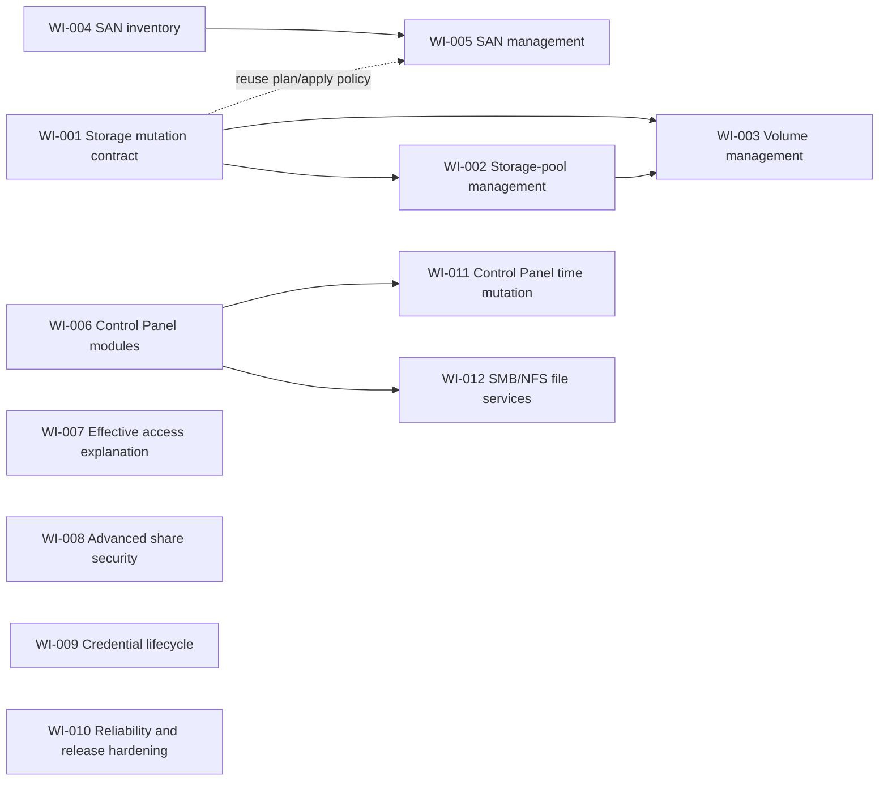

# Roadmap

The management-first sequence is storage, SAN, and focused Control Panel
modules. Reliability and explanation work can proceed in parallel because it
does not depend on destructive storage APIs.

## Dependency graph

## Work queue

| ID | Priority | Status | Parallel group | Depends on | Summary |
| --- | --- | --- | --- | --- | --- |
| [WI-001](work-items/WI-001-storage-mutation-contract.md) | P0 | `done` | A | — | Define storage manifests and hash-bound plan/apply without enabling writes. |
| [WI-002](work-items/WI-002-storage-pool-management.md) | P0 | `done` | A | WI-001 | Guarded storage-pool create/expand/delete variants. |
| [WI-003](work-items/WI-003-volume-management.md) | P0 | `done` | A | WI-001, WI-002 | Guarded volume create/update/delete variants. |
| [WI-004](work-items/WI-004-san-inventory.md) | P0 | `done` | B | — | Read-only iSCSI target, LUN, and mapping inventory. |
| [WI-005](work-items/WI-005-san-management.md) | P1 | `done` | B | WI-004, WI-001 | Guarded SAN target/LUN/mapping management. |
| [WI-006](work-items/WI-006-control-panel-modules.md) | P1 | `done` | C | — | Establish focused Control Panel module boundaries and ship the first read slice. |
| [WI-007](work-items/WI-007-effective-access-explanation.md) | P1 | `done` | D | — | Explain effective share and application access across memberships and inheritance. |
| WI-008 | P2 | `proposed` | E | product decisions | Encrypted-share keys, WORM, and custom Windows ACL safeguards. |
| WI-009 | P2 | `proposed` | D | — | Credential status/removal and trusted-device rotation. |
| WI-010 | P1 | `proposed` | E | ongoing | Structured DSM errors, observability, CI matrix, packaging, and release policy. |
| [WI-011](work-items/WI-011-control-panel-time-mutation.md) | P2 | `done` | C | WI-006 | Guarded time zone, display format, and NTP changes. |
| [WI-012](work-items/WI-012-file-services-smb-nfs.md) | P1 | `done` | C | WI-006 | Guarded global SMB and NFS state and settings. |

Parallel groups indicate likely file overlap. Items in different groups may run
at the same time after checking their `touches` lists. Only one agent should
work on an individual item.

## Milestone definition

### M1 — Storage composition

An LLM or CLI user can describe supported storage-pool and volume topology,
receive a deterministic plan, inspect destructive consequences, and apply only
against a deliberately provisioned test target.

### M2 — SAN composition

The same application layer can inventory and manage targets, LUNs, and mappings
without exposing raw DSM API calls.

### M3 — Control Panel composition

Focused modules expose typed state and changes for selected system settings.
The project does not become an untyped generic configuration proxy.

### M4 — Operational standard

Compatibility evidence, error semantics, packaging, and documentation are
strong enough for third-party integrations to depend on stable CLI/MCP schemas.
